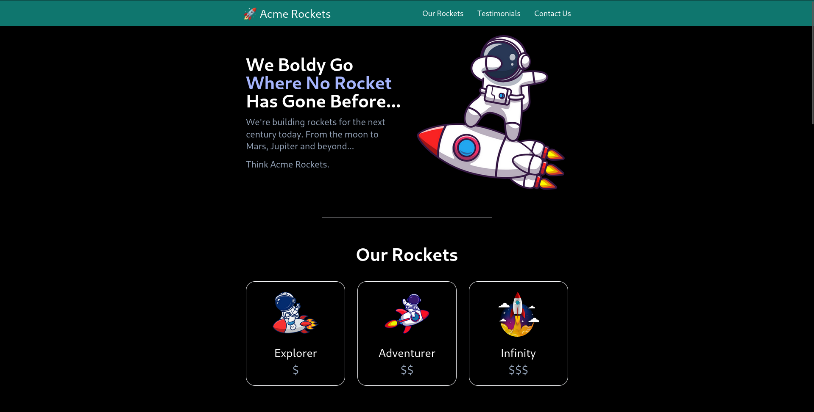
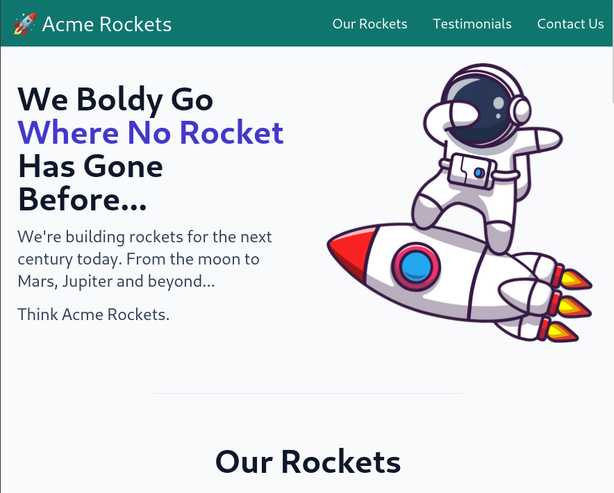
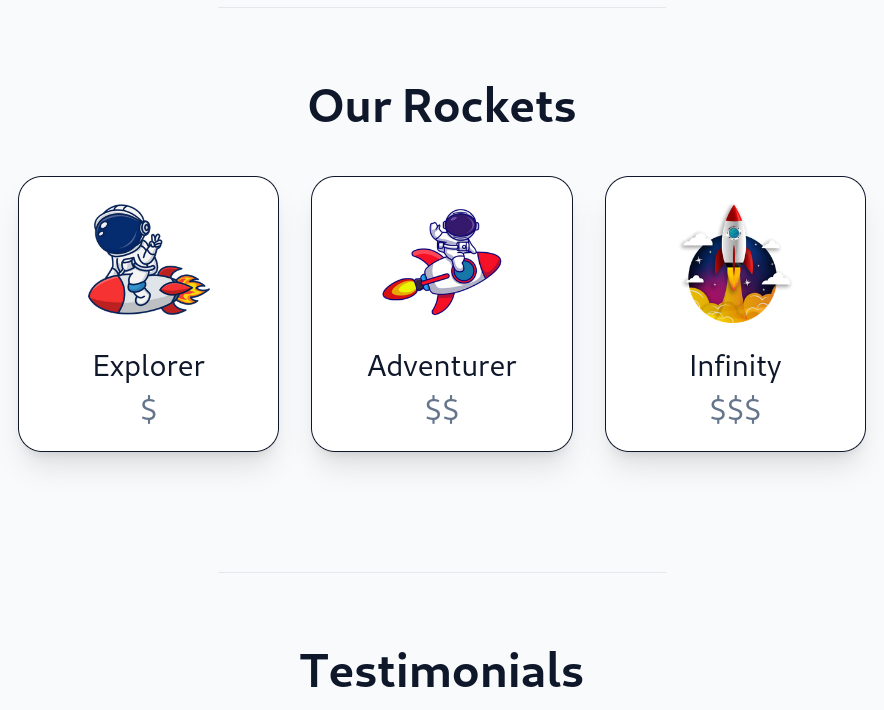
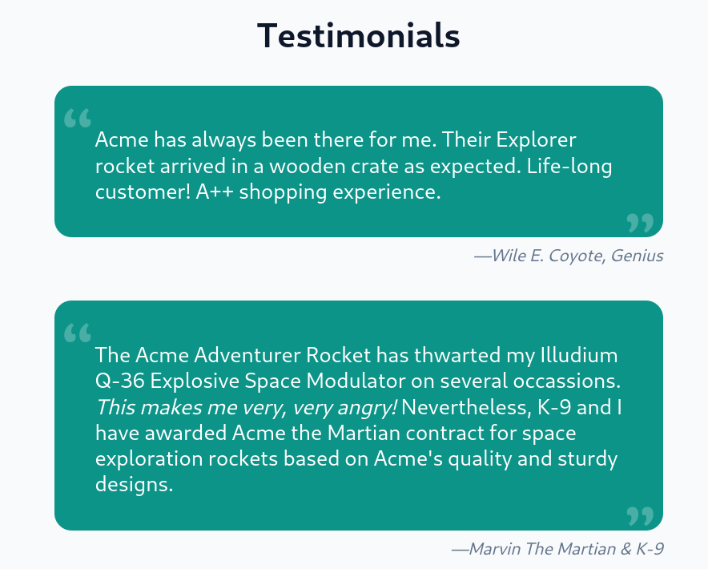
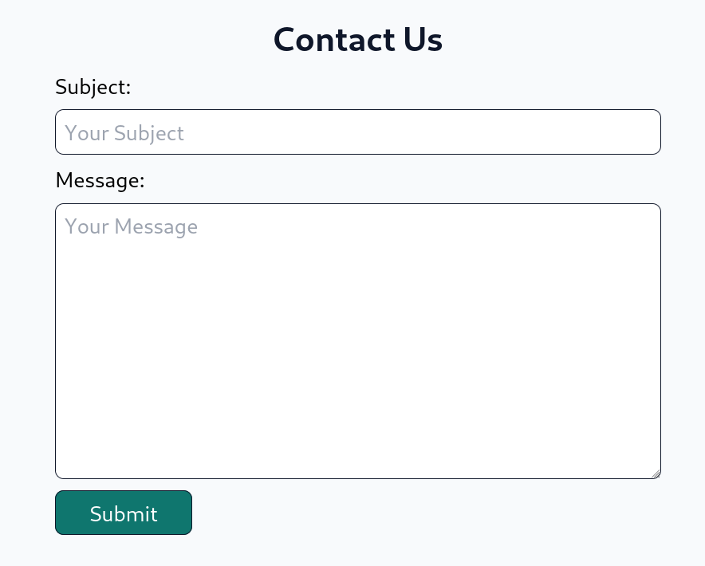

# Acme Rockets

**Welcome to AcmeRockets** – *where tech meets 🎨design*! Our repository hosts a dynamic, visually stunning static website showcasing **revolutionary 🚀rocket-powered products**. Ideal for 🌌aerospace enthusiasts and curious visitors, our project promises an immersive experience with *responsive design*.

**Explore cutting-edge rocket tech**, with a sleek interface for seamless viewing across devices. Uncover the engineering marvels behind each rocket through **rich multimedia content**. Join us on a journey through *innovation* and the *future of 🚀space exploration*!



## Features

- **Responsive Design:** Enjoy a 🌐 seamless browsing experience on various devices.
- **Navigation:** Effortlessly explore different sections of the website using the intuitive 🚀 navigation bar and mobile menu.
- **Product Showcase:** Dive into details about Acme Rockets' rocket models, complete with 💲 pricing information.
- **Testimonials:** Read testimonials from customers, including renowned figures such as Wile E. Coyote and Buzz Lightyear! 🌟
- **Contact Form:** Interact with Acme Rockets by using the ✉️ contact form for inquiries or feedback.

<div style="display: flex; justify-content: space-around;">
    
    
    
    
</div>


---

# Getting Started

## Prerequisites

- **Web Browser**:Ensure you have a modern web browser such as Chrome, Firefox, Safari, or any equivalent.

## Installation

Get started by cloning the repository:
```bash
git clone https://github.com/Jagroop2001/AcmeRockets.git
```
After cloning, open the `index.html` file in your preferred web browser.

# Contributions Guidelines

We highly appreciate and encourage community contributions to elevate the AcmeRockets project. To make your contribution seamless, please adhere to the following guidelines:

1. **Fork the Repository:**
   - *Fork the project repository* to your GitHub account.

2. **Clone the Forked Repository:**
   - Clone the forked repository to *your local machine*:

```bash
git clone https://github.com/yourusername/AcmeRockets.git
```

3. **Create a New Branch**:
    - Create a **new branch** for your feature or bug fix:

```bash
cd /AcmeRockets
git switch -b your-branch-name
```

4. **Ask for Assignment**:

    - Review **existing issues** *or* **express your interest in a specific task**.

5. **Make Changes**:

    - *Implement your changes*.

6. **Commit Changes**:

    - *Add* and *commit* your changes:

```bash
git add .
git commit -m 'Add a new feature'
```

7. **Push to the Branch**:

    - **Push** *your changes to the branch on your* **forked repository**:

```bash
git push -u origin your-branch-name
```

8. **Open a Pull Request**:

    - Open a **pull request** to propose your changes to the **original repository**.


# Code Style

To maintain a consistent and readable codebase, please adhere to the existing code style and formatting conventions. Consistency in code style helps ensure collaboration and makes the development process smoother.

# Issue Tracker

Before diving into new features or fixes, it's crucial to check our [issue tracker](https://github.com/Jagroop2001/AcmeRockets/issues). This step ensures that you are aware of any existing issues or feature requests related to your intended contribution. This proactive approach helps in avoiding duplicate efforts and contributes to an organized development process.


# Code of Conduct

We believe in fostering a positive and inclusive community. All contributors are expected to follow our Code of Conduct. This code sets the standard for respectful and collaborative behavior. By adhering to the Code of Conduct, you contribute to creating a welcoming environment for everyone involved in the AcmeRockets project.

Thank you for your commitment to making AcmeRockets a great community and project!

Happy coding and rocket exploring! 🚀